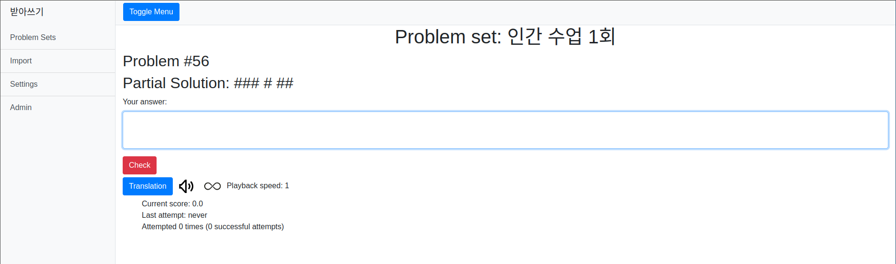
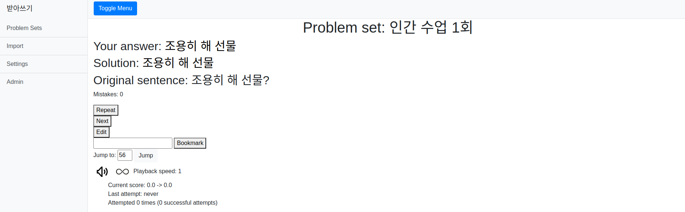
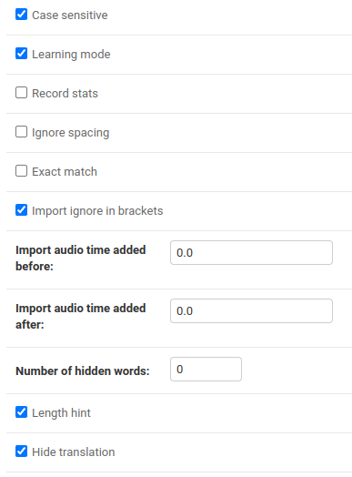
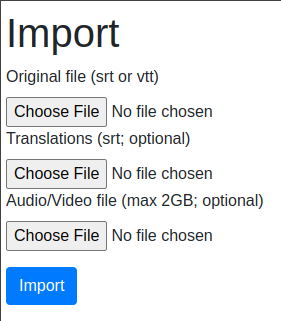

<h1 style="text-align: center">받아쓰기</h1>
<p>
Simple web based application facilitating Korean language acquisition through dictation and repetition written in Python (<a href="https://www.djangoproject.com/">Django</a>).</p>
<p>
Requires Python >=3.8 and <a href="https://www.ffmpeg.org">ffmepg</a> on path.
</p>



<div style="align-content: center">
<table>
<tr>
<td>
</td>
<td>
</td>
</tr>
</table>
</div>


<h2>Setup instructions:</h2>

<ol>
<li>Download and install <a href="https://git-scm.com/downloads">Git</a></li>
<li>Clone the project with 'git clone https://github.com/markon64/badasseugi.git' command into a directory of your choosing</li>
<li>Download Python interpreter version >=3.8 https://www.python.org/downloads/release/python-380/</li>
<li>Download <a href="https://www.ffmpeg.org/">FFMEPG</a> and put it on your path</li>
<li>Execute following commands in the project directory (Windows):</li>

````
python -m venv env
env\Scripts\activate.bat
pip install -r requirements.txt
python manage.py migrate
````

<li>Create user:</li>

````
python manage.py createsuperuser
````

<li>Start server:</li>

````
python manage.py runserver
````

</ol>